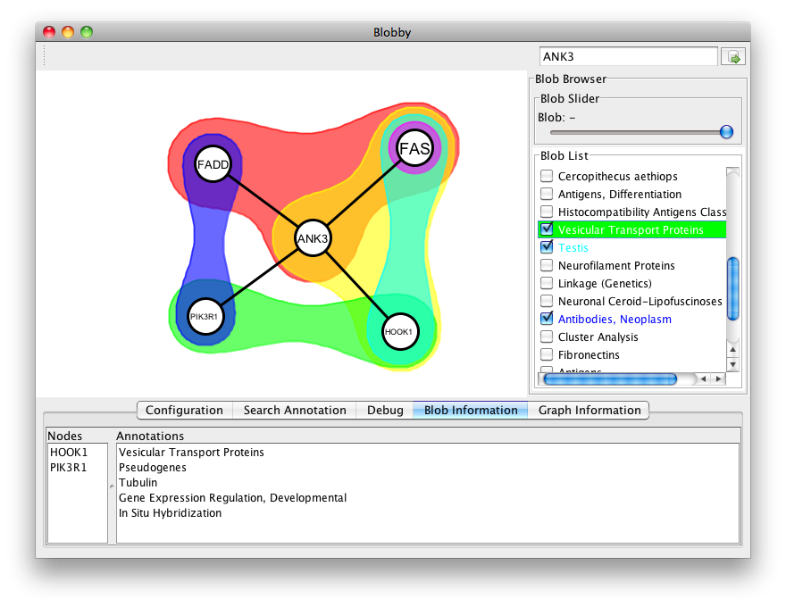

# no-blobby-you-know (blobby.js)
JavaScript for HTML5 Canvas rendering of hypergraphs overlaid by simple graphs as Euler diagrams (or blobs).  Intended for visualization of simple graphs annotated by incidence relation.

It is currently refactored from some really bad procedural style code that I wrote to figure out how to draw blobs, and the repo is only partially setup.

##Context
In bioinformatics it is fairly common to deal with gene annotation data.
These may come from ontologies like the GO (the Gene Ontologies), or they may be derived as, say, terms that cooccur with the gene's name in a sentence of a journal article.
Genes (or the proteins that are made from them) can also be related in a network representing some form of relationship, like a molecular interaction between their protein products.
The goal is to "annotate" the graph with the gene annotations as described  in my [graph annotation](http://www.slideshare.net/BenjaminKeller/graphannotation0714)
presentation.

Blobby is a Java program that was originally developed by Byron Heads, Fatimah Al Ismail, John Markus, Lukas Lang and Stefan Burger, who were students in my first offering of the special topics course "Software for Scientific Reasoning" that I ran a few times at Eastern Michigan University.

When run, Blobby looks like this, and allowed you to add or remove annotations or blobs. Blobby uses the Jung hypergraph implementation, and users are able to drag the vertices around the screen. But, Blobby itself doesn't do any sophisticated layout.

##What blobby.js does (and will do)
With blobby.js, the intent is simply to render an already laid-out graph/hypergraph to Canvas, allowing for style (e.g., color) changes.
Interactivity may come as its needed.

Like the original Blobby, I'm not trying to detect a bad graph layout. Meaning that a vertex might be rendered over top of the blob for a hyperedge that it does not belong to.  This is a layout issue, which would have to be resolved in this code if users are allowed to rearrange the graph.

##What you'll need
The code is written in EcmaScript 6 with Flow annotations. At a minimum, you will need **npm** to get started. Head over to [node.js](https://nodejs.org) for installation information on installing **node**, which will get you **npm**. Once you have it installed, it should be sufficient to run

    npm install

to get everything going.

If you are going to do any coding, you'll also need **flow** (see [flowtype.org](http://flowtype.org))

##The code
Flow and ES6 have a tense relationship, and while my goal was to take advantage of ES6 as much as possible, when flow says "Unimplemented: WHATEVER" then I stripped out my use of WHATEVER. At the moment, this is just let/const instead of var, since I decided that I could live with it complaining about ES6 module import.

##Using blobby.js
The model for blobby is that the style and layout of the graph are maps from its components.
Components of a graph, using flow types, are simply objects:

    type Node = { id: string, label: string };
    type Edge = { id: string, label: string, nodes: Array<Node> };
    type Arc =  { id: string, label: string, src: Node, tgt: Node };

where an Arc is actually just a simple edge. A Graph is simply a tuple of sets of these components.

A graph is built from arrays for nodes, edges and arcs as in

    var nodes = [ n1, n2, n3, n4, n5 ];
    var edges = [ e3, e4, e1, e2 ];
    var arcs = [ a1, a2, a3, a4 ];
    var gph = blobby.createGraph(nodes,edges,arcs);

The order of the hyperedges is used when rendering the graph (more below).

A layout is determined by the assignment of points to vertices, which can be specified using an object literal like

    var nodepos = {
      "1": { "x": 500, "y": 200 },
      "2": { "x": 400, "y": 600 },
      "3": { "x": 200, "y": 400 },
      "4": { "x": 560, "y": 480 },
      "5": { "x": 250, "y": 160 }
    };

which specifies the node id and corresponding position. Using this information the layout of hyperedges and arcs is inferred.

The layout construction depends on both the graph and the node positions, and would be built as

    var gphLayout = blobby.createLayout(gph,nodepos);

A hyperedge is drawn as a shape following the convex hull of the locations of the nodes. So, to avoid a node that is not in an edge being rendered over the edge it has to be outside of the convex hull for the edge nodes.

A padding size parameter must be given to determine how far the boundary of the edge shape will be from each point. Except for edges that are pairs of nodes (different from an arc), the edge shape is effectively formed by connecting circles drawn around each convex hull point with the pad size as the radius. The padding size is (currently) given as part of an edge style object (discussed below).

Rendering of the graph is done using the layout and style. The layout determines the position of the nodes/edges/arcs, while the style determines what they look like. Each component type has its own style type:

    type NodeStyle = {
      size: number,
      fillColor: string,
      strokeColor: string,
      strokeWidth: number
    };

    type EdgeStyle = {
      padSize: number,
      fillColor: string,
      strokeColor: string
      strokeWidth: number
    }

    type ArcStyle = {
      strokeColor: string,
      strokeWidth: number
    };

The styles for each kind of component are given in an object for each type of component to a corresponding style object – so having the types:

   { [id: string]: NodeStyle }
   { [id: string]: EdgeStyle }
   { [id: string]: ArcStyle }

Each node, hyperedge, or arc must have a specified style, or it will not be rendered. The style map is constructed like this

    var gphStyles = blobby.createStyleMap(nodeStyles,edgeStyles,arcStyles);

Once we have each of these pieces we can draw the graph with

    blobby.drawHypergraph(ctx,gph,gphLayout,gphStyles);

where **ctx** is the canvas context object.

## Pointers

Specific points to ponder when setting up a graph:

1. Nodes not in an edge should be outside of the convex hull of the nodes in the edge, otherwise they will be drawn over the edge shape.
2. Hyperedges should be given in decreasing order of inclusion: if an edge is a subset of another edge, it should come after the first one. Otherwise, the larger edge will obscure the smaller one when rendered.
3. Components are only rendered if they have a specified style. You can use this to hide a component.
